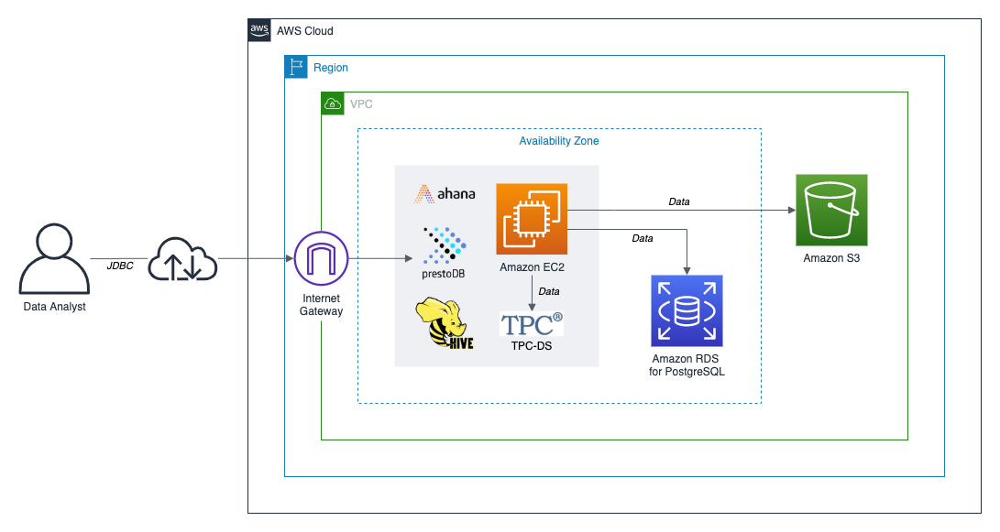

# Presto Federated Queries

## Getting Started with Presto Federated Queries using Ahana's PrestoDB Sandbox on AWS

Project files for the post, [Presto Federated Queries: Getting Started with Presto Federated Queries using Ahana's PrestoDB Sandbox on AWS](https://tinyurl.com/presto-query). All directions for using this project are detailed in the post.

## Project Architecture

